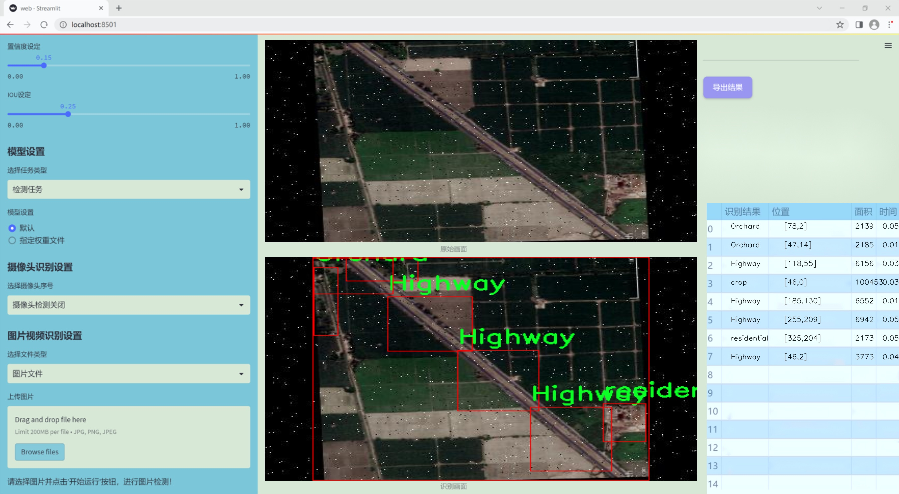
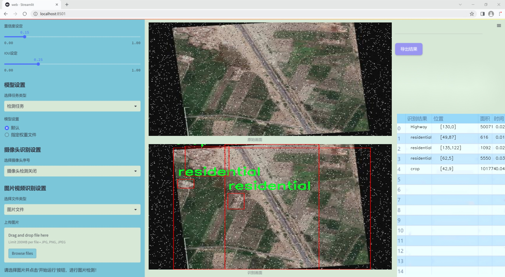

# 改进yolo11-OREPANCSPELAN等200+全套创新点大全：土地覆盖类型识别系统源码＆数据集全套

### 1.图片效果展示






##### 项目来源 **[人工智能促进会 2024.10.30](https://kdocs.cn/l/cszuIiCKVNis)**

注意：由于项目一直在更新迭代，上面“1.图片效果展示”和“2.视频效果展示”展示的系统图片或者视频可能为老版本，新版本在老版本的基础上升级如下：（实际效果以升级的新版本为准）

  （1）适配了YOLOV11的“目标检测”模型和“实例分割”模型，通过加载相应的权重（.pt）文件即可自适应加载模型。

  （2）支持“图片识别”、“视频识别”、“摄像头实时识别”三种识别模式。

  （3）支持“图片识别”、“视频识别”、“摄像头实时识别”三种识别结果保存导出，解决手动导出（容易卡顿出现爆内存）存在的问题，识别完自动保存结果并导出到tempDir中。

  （4）支持Web前端系统中的标题、背景图等自定义修改。

  另外本项目提供训练的数据集和训练教程,暂不提供权重文件（best.pt）,需要您按照教程进行训练后实现图片演示和Web前端界面演示的效果。

### 2.视频效果展示

[2.1 视频效果展示](https://www.bilibili.com/video/BV1zbSiYYE3n/)

### 3.背景

研究背景与意义

随着全球城市化进程的加速和土地资源的日益紧张，土地覆盖类型的准确识别与监测已成为环境科学、城市规划和资源管理等领域的重要研究课题。土地覆盖类型不仅反映了地表的自然状态和人类活动的影响，还直接关系到生态系统的健康、气候变化的响应以及可持续发展的策略制定。因此，开发高效、准确的土地覆盖类型识别系统具有重要的理论价值和实际意义。

近年来，深度学习技术的迅猛发展为图像识别领域带来了新的机遇，尤其是目标检测算法的进步，使得土地覆盖类型的自动识别成为可能。YOLO（You Only Look Once）系列算法因其高效性和实时性在目标检测任务中得到了广泛应用。YOLOv11作为该系列的最新版本，结合了多种先进的网络结构和优化技术，具备了更强的特征提取能力和更高的检测精度。然而，针对特定应用场景的改进仍然是提升模型性能的关键。

本研究旨在基于改进的YOLOv11算法，构建一个高效的土地覆盖类型识别系统。我们将利用包含546幅图像的gis_dataset数据集，该数据集涵盖了多种土地覆盖类型，包括高速公路、工业区、果园、牧场、河流、荒地、农田、森林和居民区等。这些类别的多样性为模型的训练和测试提供了丰富的样本，有助于提高识别的准确性和鲁棒性。

通过对YOLOv11的改进，我们期望能够在土地覆盖类型识别中实现更高的精度和更快的处理速度，从而为土地管理、环境监测和城市规划提供有力的技术支持。这一研究不仅有助于推动遥感技术和人工智能在土地利用研究中的应用，也为相关政策的制定和实施提供科学依据，具有重要的社会和经济价值。

### 4.数据集信息展示

##### 4.1 本项目数据集详细数据（类别数＆类别名）

nc: 9
names: ['Highway', 'Industry', 'Orchard', 'Rangeland', 'River', 'barren land', 'crop', 'forest', 'residential']


该项目为【目标检测】数据集，请在【训练教程和Web端加载模型教程（第三步）】这一步的时候按照【目标检测】部分的教程来训练

##### 4.2 本项目数据集信息介绍

本项目数据集信息介绍

本项目所使用的数据集名为“gis_dataset”，旨在为改进YOLOv11的土地覆盖类型识别系统提供高质量的训练数据。该数据集包含九个不同的土地覆盖类型，具体类别包括：高速公路、工业区、果园、牧场、河流、荒地、农田、森林和住宅区。这些类别的选择充分考虑了城市与乡村的多样性，涵盖了自然环境与人类活动的广泛范围，能够有效支持模型在实际应用中的泛化能力。

“gis_dataset”中的数据来源于多种遥感影像和地理信息系统（GIS）数据，确保了数据的多样性和代表性。每个类别的样本数量经过精心设计，以保证在训练过程中，模型能够学习到各类土地覆盖特征的细微差别。例如，高速公路和工业区的特征明显不同，而果园与农田则可能在某些特征上存在相似性，这为模型的学习提供了挑战和机会。

此外，数据集中的样本均经过标注，确保了训练数据的准确性和可靠性。标注过程采用了专业的地理信息专家进行，确保每个样本的类别标识清晰且符合实际情况。这一过程不仅提高了数据集的质量，也为后续的模型训练提供了坚实的基础。

在训练过程中，改进YOLOv11将利用这些多样化的土地覆盖类型数据，学习如何更好地识别和分类不同的地理特征，从而提升其在实际应用中的性能。通过对“gis_dataset”的深入分析与应用，我们期望能够显著提高土地覆盖类型识别的准确性和效率，为相关领域的研究和实践提供有力支持。


### 5.全套项目环境部署视频教程（零基础手把手教学）

[5.1 所需软件PyCharm和Anaconda安装教程（第一步）](https://www.bilibili.com/video/BV1BoC1YCEKi/?spm_id_from=333.999.0.0&vd_source=bc9aec86d164b67a7004b996143742dc)


[5.2 安装Python虚拟环境创建和依赖库安装视频教程（第二步）](https://www.bilibili.com/video/BV1ZoC1YCEBw?spm_id_from=333.788.videopod.sections&vd_source=bc9aec86d164b67a7004b996143742dc)

### 6.改进YOLOv11训练教程和Web_UI前端加载模型教程（零基础手把手教学）

[6.1 改进YOLOv11训练教程和Web_UI前端加载模型教程（第三步）](https://www.bilibili.com/video/BV1BoC1YCEhR?spm_id_from=333.788.videopod.sections&vd_source=bc9aec86d164b67a7004b996143742dc)


按照上面的训练视频教程链接加载项目提供的数据集，运行train.py即可开始训练



     Epoch   gpu_mem       box       obj       cls    labels  img_size
     1/200     20.8G   0.01576   0.01955  0.007536        22      1280: 100%|██████████| 849/849 [14:42<00:00,  1.04s/it]
               Class     Images     Labels          P          R     mAP@.5 mAP@.5:.95: 100%|██████████| 213/213 [01:14<00:00,  2.87it/s]
                 all       3395      17314      0.994      0.957      0.0957      0.0843

     Epoch   gpu_mem       box       obj       cls    labels  img_size
     2/200     20.8G   0.01578   0.01923  0.007006        22      1280: 100%|██████████| 849/849 [14:44<00:00,  1.04s/it]
               Class     Images     Labels          P          R     mAP@.5 mAP@.5:.95: 100%|██████████| 213/213 [01:12<00:00,  2.95it/s]
                 all       3395      17314      0.996      0.956      0.0957      0.0845

     Epoch   gpu_mem       box       obj       cls    labels  img_size
     3/200     20.8G   0.01561    0.0191  0.006895        27      1280: 100%|██████████| 849/849 [10:56<00:00,  1.29it/s]
               Class     Images     Labels          P          R     mAP@.5 mAP@.5:.95: 100%|███████   | 187/213 [00:52<00:00,  4.04it/s]
                 all       3395      17314      0.996      0.957      0.0957      0.0845


###### [项目数据集下载链接](https://kdocs.cn/l/cszuIiCKVNis)

### 7.原始YOLOv11算法讲解


其实到了YOLOV11 基本创新点就不太多了，主要就是大家互相排列组合复用不同的网络模块、损失函数和样本匹配策略，需要注意YOLO V5、V8 V11
都是1个公司的，其余的个人建议看看V8的，剩下的了解就好。

V11支持多种视觉任务：物体检测、实例分割、图像分类、姿态估计和定向物体检测（OBB）。

##### YOLOv11
基本和YOLOV8同源，甚至git目前都是1个，部分代码注释还是YOLOV8的，所以建议先看我写的YOLOV8相关博客，对比YOLOV8主要涉及到：

*backbone 中的使用C2f模块 变为 c3k2 模块。

*backbone 中的最后一层（sppf层）后增加了C2PSA模块。

*head 解耦头中的分类检测头两个Conv 变为 DWConv。

整体技术而言：

*backbone 使用了C2K2模块+最后SPPF模块级联C2PSA模块；

*neck 使用PAN结构，并且里面也使用C3K2模块；

*head使用了anchor-free + Decoupled-head，其中回归头使用正常的卷积，分类头使用DWConv；

*损失函数使用了分类BCE、回归CIOU + VFL的组合；

*框匹配策略由静态匹配改为了Task-Aligned Assigner匹配方式；

*训练策略没有提及，其中YOLOV8可以参考如下最后 10 个 epoch 关闭 Mosaic 的操作、训练总 epoch 数从 300 提升到了 500。

##### 主要思路


配置文件：[ultralytics/ultralytics/cfg/models/11/yolo11.yaml at main ·
ultralytics/ultralytics ·
GitHub](https://github.com/ultralytics/ultralytics/blob/main/ultralytics/cfg/models/11/yolo11.yaml
"ultralytics/ultralytics/cfg/models/11/yolo11.yaml at main ·
ultralytics/ultralytics · GitHub")

解析函数：[ultralytics/ultralytics/nn/tasks.py at main · ultralytics/ultralytics ·
GitHub](https://github.com/ultralytics/ultralytics/blob/main/ultralytics/nn/tasks.py#L934
"ultralytics/ultralytics/nn/tasks.py at main · ultralytics/ultralytics ·
GitHub")


##### 具体细节

##### input

输入要求以及预处理，可选项比较多，可以参考这个配置文件：[ultralytics/ultralytics/cfg/default.yaml at main
· ultralytics/ultralytics ·
GitHub](https://github.com/ultralytics/ultralytics/blob/main/ultralytics/cfg/default.yaml
"ultralytics/ultralytics/cfg/default.yaml at main · ultralytics/ultralytics ·
GitHub") 的Hyperparameters 部分。

基础输入仍然为640*640。预处理就是熟悉的letterbox（根据参数配置可以为不同的缩放填充模式，主要用于resize到640）+
转换rgb、chw、int8(0-255)->float（0-1），注意没有归一化操作。需要注意的是作者实现的mosaic和网上看到的不同，对比如下图（左边网上版本，右边是YOLO的实现）。并且作者添加了在最后10轮关闭mosaic增强（YOLOV8开始支持，具体原因个人的经验如我的这篇文章：yolov5
mosaic相关，关闭参数在 Train settings 部分的close_mosaic 选项）


##### backbone

主干网络以及改进

这里不去特意强调对比YOLOv5、V8等等的改进，因为各个系列都在疯狂演进，个人认为没必要花费时间看差异，着重看看一些比较重要的模块即可。源代码：

大多数模块：[ultralytics/ultralytics/nn/modules/block.py at main ·
ultralytics/ultralytics ·
GitHub](https://github.com/ultralytics/ultralytics/blob/main/ultralytics/nn/modules/block.py
"ultralytics/ultralytics/nn/modules/block.py at main · ultralytics/ultralytics
· GitHub")

head 部分：[ultralytics/ultralytics/nn/modules/head.py at main ·
ultralytics/ultralytics ·
GitHub](https://github.com/ultralytics/ultralytics/blob/main/ultralytics/nn/modules/head.py
"ultralytics/ultralytics/nn/modules/head.py at main · ultralytics/ultralytics
· GitHub")

串联模块构造网络：[ultralytics/ultralytics/nn/tasks.py at main ·
ultralytics/ultralytics ·
GitHub](https://github.com/ultralytics/ultralytics/blob/main/ultralytics/nn/tasks.py
"ultralytics/ultralytics/nn/tasks.py at main · ultralytics/ultralytics ·
GitHub")

##### 1）CBS 模块（后面叫做Conv）

就是pytorch 自带的conv + BN +SiLU，这里对应上面的配置文件的Conv 的 args 比如[64, 3, 2] 就是 conv2d
的c2=64、k=3、 s =2、c1 自动为上一层参数、p 为自动计算，真实需要计算scales 里面的with 和 max_channels 缩放系数。

这里连续使用两个3*3卷积stride为2的CBS模块直接横竖各降低了4倍分辨率（整体变为原来1/16）。这个还是比较猛的，敢在如此小的感受野下连续两次仅仅用一层卷积就下采样,当然作为代价它的特征图还是比较厚的分别为16、32。


    
    
        class Conv(nn.Module):
        """Standard convolution with args(ch_in, ch_out, kernel, stride, padding, groups, dilation, activation)."""
    
        default_act = nn.SiLU()  # default activation
    
        def __init__(self, c1, c2, k=1, s=1, p=None, g=1, d=1, act=True):
            """Initialize Conv layer with given arguments including activation."""
            super().__init__()
            self.conv = nn.Conv2d(c1, c2, k, s, autopad(k, p, d), groups=g, dilation=d, bias=False)
            self.bn = nn.BatchNorm2d(c2)
            self.act = self.default_act if act is True else act if isinstance(act, nn.Module) else nn.Identity()
    
        def forward(self, x):
            """Apply convolution, batch normalization and activation to input tensor."""
            return self.act(self.bn(self.conv(x)))
    
        def forward_fuse(self, x):
            """Perform transposed convolution of 2D data."""
            return self.act(self.conv(x))

##### 2）c3k2 模块

##### Bottleneck

有两种结构，需要参数shortcut和两个conv的宽度是否相同来控制。

##### C3 & C3K

都是CSP bottleneck module with 3 convolutions, C3 代表3个卷积层，
K代表其中bottleneck中的卷积核为支持自定义，其实这里c3k作者使用的默认的3*3卷积核也就等同于使用c3(c3是3*3卷积核)。

##### c2f & c3k2

其实也就是仿照YOLOv7 的ELAN
结构，通过更多的分支夸层链接，丰富了模型的梯度流。C3K2模块其实就是C2F模块转变出来的，它代码中有一个设置，就是当c3k这个参数为FALSE的时候，C3K2模块就是C2F模块，也就是说它的Bottleneck是普通的Bottleneck；反之当它为true的时候，将Bottleneck模块替换成C3K模块。模块中存在
Split 等操作对特定硬件部署没有之前那么友好了。需要针对自己的硬件进行测试看对最终推理速度的影响。

可视化关系如下，这里需要注意配置文件中的参数，比如21行[-1, 2, C3k2, [512, False, 0.25]]
512代表宽度、false代表是否使用shortcut、0.25代表c2f的宽度缩放。也就是第一个Conv的输出宽度。


源代码如下:

    
    
    class Bottleneck(nn.Module):
        """Standard bottleneck."""
    
        def __init__(self, c1, c2, shortcut=True, g=1, k=(3, 3), e=0.5):
            """Initializes a standard bottleneck module with optional shortcut connection and configurable parameters."""
            super().__init__()
            c_ = int(c2 * e)  # hidden channels
            self.cv1 = Conv(c1, c_, k[0], 1)
            self.cv2 = Conv(c_, c2, k[1], 1, g=g)
            self.add = shortcut and c1 == c2
    
        def forward(self, x):
            """Applies the YOLO FPN to input data."""
            return x + self.cv2(self.cv1(x)) if self.add else self.cv2(self.cv1(x))
    
    class C3(nn.Module):
        """CSP Bottleneck with 3 convolutions."""
    
        def __init__(self, c1, c2, n=1, shortcut=True, g=1, e=0.5):
            """Initialize the CSP Bottleneck with given channels, number, shortcut, groups, and expansion values."""
            super().__init__()
            c_ = int(c2 * e)  # hidden channels
            self.cv1 = Conv(c1, c_, 1, 1)
            self.cv2 = Conv(c1, c_, 1, 1)
            self.cv3 = Conv(2 * c_, c2, 1)  # optional act=FReLU(c2)
            self.m = nn.Sequential(*(Bottleneck(c_, c_, shortcut, g, k=((1, 1), (3, 3)), e=1.0) for _ in range(n)))
    
        def forward(self, x):
            """Forward pass through the CSP bottleneck with 2 convolutions."""
            return self.cv3(torch.cat((self.m(self.cv1(x)), self.cv2(x)), 1))
    
    class C3k(C3):
        """C3k is a CSP bottleneck module with customizable kernel sizes for feature extraction in neural networks."""
    
        def __init__(self, c1, c2, n=1, shortcut=True, g=1, e=0.5, k=3):
            """Initializes the C3k module with specified channels, number of layers, and configurations."""
            super().__init__(c1, c2, n, shortcut, g, e)
            c_ = int(c2 * e)  # hidden channels
            # self.m = nn.Sequential(*(RepBottleneck(c_, c_, shortcut, g, k=(k, k), e=1.0) for _ in range(n)))
            self.m = nn.Sequential(*(Bottleneck(c_, c_, shortcut, g, k=(k, k), e=1.0) for _ in range(n)))
    
    class C2f(nn.Module):
        """Faster Implementation of CSP Bottleneck with 2 convolutions."""
    
        def __init__(self, c1, c2, n=1, shortcut=False, g=1, e=0.5):
            """Initializes a CSP bottleneck with 2 convolutions and n Bottleneck blocks for faster processing."""
            super().__init__()
            self.c = int(c2 * e)  # hidden channels
            self.cv1 = Conv(c1, 2 * self.c, 1, 1)
            self.cv2 = Conv((2 + n) * self.c, c2, 1)  # optional act=FReLU(c2)
            self.m = nn.ModuleList(Bottleneck(self.c, self.c, shortcut, g, k=((3, 3), (3, 3)), e=1.0) for _ in range(n))
    
        def forward(self, x):
            """Forward pass through C2f layer."""
            y = list(self.cv1(x).chunk(2, 1))
            y.extend(m(y[-1]) for m in self.m)
            return self.cv2(torch.cat(y, 1))
    
        def forward_split(self, x):
            """Forward pass using split() instead of chunk()."""
            y = list(self.cv1(x).split((self.c, self.c), 1))
            y.extend(m(y[-1]) for m in self.m)
            return self.cv2(torch.cat(y, 1))
    
    class C3k2(C2f):
        """Faster Implementation of CSP Bottleneck with 2 convolutions."""
    
        def __init__(self, c1, c2, n=1, c3k=False, e=0.5, g=1, shortcut=True):
            """Initializes the C3k2 module, a faster CSP Bottleneck with 2 convolutions and optional C3k blocks."""
            super().__init__(c1, c2, n, shortcut, g, e)
            self.m = nn.ModuleList(
                C3k(self.c, self.c, 2, shortcut, g) if c3k else Bottleneck(self.c, self.c, shortcut, g) for _ in range(n)
            )

##### 3）sppf 模块

对比spp，将简单的并行max pooling 改为串行+并行的方式。对比如下（左边是SPP，右边是SPPF）：


    
    
        class SPPF(nn.Module):
        # Spatial Pyramid Pooling - Fast (SPPF) layer for YOLOv5 by Glenn Jocher
        def __init__(self, c1, c2, k=5):  # equivalent to SPP(k=(5, 9, 13))
            super().__init__()
            c_ = c1 // 2  # hidden channels
            self.cv1 = Conv(c1, c_, 1, 1)
            self.cv2 = Conv(c_ * 4, c2, 1, 1)
            self.m = nn.MaxPool2d(kernel_size=k, stride=1, padding=k // 2)
    
        def forward(self, x):
            x = self.cv1(x)
            with warnings.catch_warnings():
                warnings.simplefilter('ignore')  # suppress torch 1.9.0 max_pool2d() warning
                y1 = self.m(x)
                y2 = self.m(y1)
                return self.cv2(torch.cat((x, y1, y2, self.m(y2)), 1))

##### 4）C2PSA 模块

C2PSA它结合了PSA(Pointwise Spatial
Attention)块，用于增强特征提取和注意力机制。下面的图建议从左到右看，这样才能更有条理的理解，其实PSA个人感觉就是仿着VIT
的Attention来做的，是把输入C2PSA的特征图的h*w 看做VIT 的path数（也可以理解为NLP中token 个数），特征图的channel
数看做VIT特征维度（CNN的宽度，或者理解为NLP中token
编码后的特征维度），然后计算出QKV（这里需要注意第四幅图的QKV是值，不是操作，所以标注成了圆角矩形，这里是为了大家好理解），这里的Attention其实是在h*w维度计算空间Attention，个人感觉是强制给了全局感受野，并且并联了一个3*3的深度可分离卷积的单空间部分，就是仅在每一个特征图上进行3*3卷积，具体实现是通过pytorch
conv2d 的
group参数设置为特征图的通道数。特别的关于Conv的参数分别为：输入通道数、输出通道数、卷积核尺寸、pad尺寸、group数、是否有激活函数（默认silu）。图中的最后一幅省略了一些细节，可以参考源码。

注意区别C2fPSA，C2fPSA才是对 C2f 模块的扩展，通过在标准 C2f 模块中引入 PSA
块，C2fPSA实现了更强大的注意力机制，从而提高了模型对重要特征的捕捉能力。作者实现了该模块但最终没有使用。


涉及的源码：

    
    
    class Attention(nn.Module):
        """
        Attention module that performs self-attention on the input tensor.
    
        Args:
            dim (int): The input tensor dimension.
            num_heads (int): The number of attention heads.
            attn_ratio (float): The ratio of the attention key dimension to the head dimension.
    
        Attributes:
            num_heads (int): The number of attention heads.
            head_dim (int): The dimension of each attention head.
            key_dim (int): The dimension of the attention key.
            scale (float): The scaling factor for the attention scores.
            qkv (Conv): Convolutional layer for computing the query, key, and value.
            proj (Conv): Convolutional layer for projecting the attended values.
            pe (Conv): Convolutional layer for positional encoding.
        """
    
        def __init__(self, dim, num_heads=8, attn_ratio=0.5):
            """Initializes multi-head attention module with query, key, and value convolutions and positional encoding."""
            super().__init__()
            self.num_heads = num_heads
            self.head_dim = dim // num_heads
            self.key_dim = int(self.head_dim * attn_ratio)
            self.scale = self.key_dim**-0.5
            nh_kd = self.key_dim * num_heads
            h = dim + nh_kd * 2
            self.qkv = Conv(dim, h, 1, act=False)
            self.proj = Conv(dim, dim, 1, act=False)
            self.pe = Conv(dim, dim, 3, 1, g=dim, act=False)
    
        def forward(self, x):
            """
            Forward pass of the Attention module.
    
            Args:
                x (torch.Tensor): The input tensor.
    
            Returns:
                (torch.Tensor): The output tensor after self-attention.
            """
            B, C, H, W = x.shape
            N = H * W
            qkv = self.qkv(x)
            q, k, v = qkv.view(B, self.num_heads, self.key_dim * 2 + self.head_dim, N).split(
                [self.key_dim, self.key_dim, self.head_dim], dim=2
            )
    
            attn = (q.transpose(-2, -1) @ k) * self.scale
            attn = attn.softmax(dim=-1)
            x = (v @ attn.transpose(-2, -1)).view(B, C, H, W) + self.pe(v.reshape(B, C, H, W))
            x = self.proj(x)
            return x
    
    class PSABlock(nn.Module):
        """
        PSABlock class implementing a Position-Sensitive Attention block for neural networks.
    
        This class encapsulates the functionality for applying multi-head attention and feed-forward neural network layers
        with optional shortcut connections.
    
        Attributes:
            attn (Attention): Multi-head attention module.
            ffn (nn.Sequential): Feed-forward neural network module.
            add (bool): Flag indicating whether to add shortcut connections.
    
        Methods:
            forward: Performs a forward pass through the PSABlock, applying attention and feed-forward layers.
    
        Examples:
            Create a PSABlock and perform a forward pass
            >>> psablock = PSABlock(c=128, attn_ratio=0.5, num_heads=4, shortcut=True)
            >>> input_tensor = torch.randn(1, 128, 32, 32)
            >>> output_tensor = psablock(input_tensor)
        """
    
        def __init__(self, c, attn_ratio=0.5, num_heads=4, shortcut=True) -> None:
            """Initializes the PSABlock with attention and feed-forward layers for enhanced feature extraction."""
            super().__init__()
    
            self.attn = Attention(c, attn_ratio=attn_ratio, num_heads=num_heads)
            self.ffn = nn.Sequential(Conv(c, c * 2, 1), Conv(c * 2, c, 1, act=False))
            self.add = shortcut
    
        def forward(self, x):
            """Executes a forward pass through PSABlock, applying attention and feed-forward layers to the input tensor."""
            x = x + self.attn(x) if self.add else self.attn(x)
            x = x + self.ffn(x) if self.add else self.ffn(x)
            return x
        
    class C2PSA(nn.Module):
        """
        C2PSA module with attention mechanism for enhanced feature extraction and processing.
    
        This module implements a convolutional block with attention mechanisms to enhance feature extraction and processing
        capabilities. It includes a series of PSABlock modules for self-attention and feed-forward operations.
    
        Attributes:
            c (int): Number of hidden channels.
            cv1 (Conv): 1x1 convolution layer to reduce the number of input channels to 2*c.
            cv2 (Conv): 1x1 convolution layer to reduce the number of output channels to c.
            m (nn.Sequential): Sequential container of PSABlock modules for attention and feed-forward operations.
    
        Methods:
            forward: Performs a forward pass through the C2PSA module, applying attention and feed-forward operations.
    
        Notes:
            This module essentially is the same as PSA module, but refactored to allow stacking more PSABlock modules.
    
        Examples:
            >>> c2psa = C2PSA(c1=256, c2=256, n=3, e=0.5)
            >>> input_tensor = torch.randn(1, 256, 64, 64)
            >>> output_tensor = c2psa(input_tensor)
        """
    
        def __init__(self, c1, c2, n=1, e=0.5):
            """Initializes the C2PSA module with specified input/output channels, number of layers, and expansion ratio."""
            super().__init__()
            assert c1 == c2
            self.c = int(c1 * e)
            self.cv1 = Conv(c1, 2 * self.c, 1, 1)
            self.cv2 = Conv(2 * self.c, c1, 1)
    
            self.m = nn.Sequential(*(PSABlock(self.c, attn_ratio=0.5, num_heads=self.c // 64) for _ in range(n)))
    
        def forward(self, x):
            """Processes the input tensor 'x' through a series of PSA blocks and returns the transformed tensor."""
            a, b = self.cv1(x).split((self.c, self.c), dim=1)
            b = self.m(b)
            return self.cv2(torch.cat((a, b), 1))

##### 3、neck & head

##### 1）检测头

YOLOV11 Head 部分和YOLOV8是近似的，所以简单对比YOLOV5、V8、V11。


如上面图，上边是YOLOV5 的结构，中是YOLOv8 的结构，下面是YOLOV11 结构

Yolov5: 检测和分类共用一个卷积（coupled head）并且是anchor based ,其 卷积输出为（5+N class）*3，其中
5为bbox 四个值（具体代表什么不同版本略有不同，官方git有说明，历史版本见 目标检测算法——YOLOV5 ）+ 一个obj 值
（是否有目标，这个是从YOLO V1 传承下来的，个人感觉有点绕和不合理，并且后面取消），N class 为类别数，3为anchor 的数量，默认是3个。

YOLOv8：检测和分类的卷积是解耦的（decoupled），如中图，上面一条卷积支路是回归框，框的特征图channel为4*regmax，关于这个regmax
后面我们详细的解释,并不是anchor；分类的channel 为类别数。

YOLOV11：检测和分类的卷积是解耦的（decoupled），如右图，上面一条卷积支路是回归框，框的特征图channel为4*regmax，关于这个regmax
后面我们详细的解释,并不是anchor；分类的channel 为类别数，分类使用深度可分离卷积替代常规卷积降低计算量。

源码部分如下

    
    
    class Detect(nn.Module):
        """YOLO Detect head for detection models."""
    
        dynamic = False  # force grid reconstruction
        export = False  # export mode
        end2end = False  # end2end
        max_det = 300  # max_det
        shape = None
        anchors = torch.empty(0)  # init
        strides = torch.empty(0)  # init
    
        def __init__(self, nc=80, ch=()):
            """Initializes the YOLO detection layer with specified number of classes and channels."""
            super().__init__()
            self.nc = nc  # number of classes
            self.nl = len(ch)  # number of detection layers
            self.reg_max = 16  # DFL channels (ch[0] // 16 to scale 4/8/12/16/20 for n/s/m/l/x)
            self.no = nc + self.reg_max * 4  # number of outputs per anchor
            self.stride = torch.zeros(self.nl)  # strides computed during build
            c2, c3 = max((16, ch[0] // 4, self.reg_max * 4)), max(ch[0], min(self.nc, 100))  # channels
            self.cv2 = nn.ModuleList(
                nn.Sequential(Conv(x, c2, 3), Conv(c2, c2, 3), nn.Conv2d(c2, 4 * self.reg_max, 1)) for x in ch
            )
            self.cv3 = nn.ModuleList(
                nn.Sequential(
                    nn.Sequential(DWConv(x, x, 3), Conv(x, c3, 1)),
                    nn.Sequential(DWConv(c3, c3, 3), Conv(c3, c3, 1)),
                    nn.Conv2d(c3, self.nc, 1),
                )
                for x in ch
            )
            self.dfl = DFL(self.reg_max) if self.reg_max > 1 else nn.Identity()
    
            if self.end2end:
                self.one2one_cv2 = copy.deepcopy(self.cv2)
                self.one2one_cv3 = copy.deepcopy(self.cv3)
    
        def forward(self, x):
            """Concatenates and returns predicted bounding boxes and class probabilities."""
            if self.end2end:
                return self.forward_end2end(x)
    
            for i in range(self.nl):
                x[i] = torch.cat((self.cv2[i](x[i]), self.cv3[i](x[i])), 1)
            if self.training:  # Training path
                return x
            y = self._inference(x)
            return y if self.export else (y, x)

因此主要的变化可以认为有三个：（1）coupled head -> decoupled head ；（2）obj 分支消失；（3）anchor
based——> anchor free ; 4) 深度可分离卷积。

（1）coupled head -> decoupled head

这个解耦操作，看YOLO x 的论文，约有1% 的提升。逻辑和实现都比较直观易懂，不再赘述。

（2）obj 分支消失；

这个其实我自己再看YOLO V1 的时候就有疑问，它存在的意义。后来人们发现，其实obj
的在训练和推理过程中存在逻辑不一致性。具体而言（摘自“<https://zhuanlan.zhihu.com/p/147691786>”）

A。用法不一致。训练的时候，分类和质量估计各自训练自个儿的，但测试的时候却又是乘在一起作为NMS score排序的依据，这个操作显然没有end-to-
end，必然存在一定的gap。（个人认为还好，就是两个监督信号）

B。对象不一致。借助Focal
Loss的力量，分类分支能够使得少量的正样本和大量的负样本一起成功训练，但是质量估计通常就只针对正样本训练。那么，对于one-
stage的检测器而言，在做NMS
score排序的时候，所有的样本都会将分类score和质量预测score相乘用于排序，那么必然会存在一部分分数较低的“负样本”的质量预测是没有在训练过程中有监督信号的，对于大量可能的负样本，他们的质量预测是一个未定义行为。这就很有可能引发这么一个情况：一个分类score相对低的真正的负样本，由于预测了一个不可信的极高的质量score，而导致它可能排到一个真正的正样本（分类score不够高且质量score相对低）的前面。问题一如图所示：


（3）anchor based——> anchor free

这里主要涉及怎么定义回归内容以及如何匹配GT框的问题。也就是如下：

##### 2）匹配策略

A。回归的内容当前版本就是回归的lftp四个值（这四个值是距离匹配到的anchor 点的距离值！不是图片的绝对位置）。后面推理阶段通过
dist2bbox函数转换为需要的格式：

[
https://github.com/ultralytics/ultralytics/blob/cc3c774bde86ffce694d202b7383da6cc1721c1b/ultralytics/nn/modules.py#L378](https://github.com/ultralytics/ultralytics/blob/cc3c774bde86ffce694d202b7383da6cc1721c1b/ultralytics/nn/modules.py#L378
"  
 https://github.com/ultralytics/ultralytics/blob/cc3c774bde86ffce694d202b7383da6cc1721c1b/ultralytics/nn/modules.py#L378")

[
https://github.com/ultralytics/ultralytics/blob/cc3c774bde86ffce694d202b7383da6cc1721c1b/ultralytics/yolo/utils/tal.py#L196](https://github.com/ultralytics/ultralytics/blob/cc3c774bde86ffce694d202b7383da6cc1721c1b/ultralytics/yolo/utils/tal.py#L196
"  
 https://github.com/ultralytics/ultralytics/blob/cc3c774bde86ffce694d202b7383da6cc1721c1b/ultralytics/yolo/utils/tal.py#L196")。

    
    
       def dist2bbox(distance, anchor_points, xywh=True, dim=-1):
        """Transform distance(ltrb) to box(xywh or xyxy)."""
        lt, rb = torch.split(distance, 2, dim)
        x1y1 = anchor_points - lt
        x2y2 = anchor_points + rb
        if xywh:
            c_xy = (x1y1 + x2y2) / 2
            wh = x2y2 - x1y1
            return torch.cat((c_xy, wh), dim)  # xywh bbox
        return torch.cat((x1y1, x2y2), dim)  # xyxy bbox

##### B.匹配策略

YOLOv5 采用静态的匹配策略，V8采用了动态的TaskAlignedAssigner，其余常见的动态匹配还有： YOLOX 的 simOTA、TOOD
的 TaskAlignedAssigner 和 RTMDet 的 DynamicSoftLabelAssigner。


TaskAligned使用分类得分和IoU的高阶组合来衡量Task-Alignment的程度。使用上面公式来对每个实例计算Anchor-level
的对齐程度：s 和 u 分别为分类得分和 IoU 值，α 和 β 为权重超参。t 可以同时控制分类得分和IoU 的优化来实现 Task-
Alignment，可以引导网络动态的关注于高质量的Anchor。采用一种简单的分配规则选择训练样本：对每个实例，选择m个具有最大t值的Anchor作为正样本，选择其余的Anchor作为负样本。然后，通过损失函数(针对分类与定位的对齐而设计的损失函数)进行训练。

代码地址：[ultralytics/ultralytics/yolo/utils/tal.py at
c0c0c138c12699807ff9446f942cb3bd325d670b · ultralytics/ultralytics ·
GitHub](https://github.com/ultralytics/ultralytics/blob/c0c0c138c12699807ff9446f942cb3bd325d670b/ultralytics/yolo/utils/tal.py#L56
"ultralytics/ultralytics/yolo/utils/tal.py at
c0c0c138c12699807ff9446f942cb3bd325d670b · ultralytics/ultralytics · GitHub")

默认参数如下（当前版本这些超参没有提供修改的接口，如需修改需要在源码上进行修改）：


##### 4、loss function

损失函数设计

Loss 计算包括 2 个分支： 分类和回归分支，没有了之前的 objectness 分支。

分类分支依然采用 BCE Loss。回归分支使用了 Distribution Focal Loss（DFL Reg_max默认为16）+ CIoU
Loss。3 个 Loss
采用一定权重比例加权即可（默认如下：<https://github.com/ultralytics/ultralytics/blob/main/ultralytics/yolo/configs/default.yaml#L83>）。


这里重点介绍一下DFL损失。目前被广泛使用的bbox表示可以看作是对bbox方框坐标建模了单一的狄拉克分布。但是在复杂场景中，一些检测对象的边界并非十分明确。如下图左面所示，对于滑板左侧被水花模糊，引起对左边界的预测分布是任意而扁平的，对右边界的预测分布是明确而尖锐的。对于这个问题，有学者提出直接回归一个任意分布来建模边界框，使用softmax实现离散的回归，将狄拉克分布的积分形式推导到一般形式的积分形式来表示边界框。


狄拉克分布可以认为在一个点概率密度为无穷大，其他点概率密度为0，这是一种极端地认为离散的标签时绝对正确的。


因为标签是一个离散的点，如果把标签认为是绝对正确的目标，那么学习出的就是狄拉克分布，概率密度是一条尖锐的竖线。然而真实场景，物体边界并非是十分明确的，因此学习一个宽范围的分布更为合理。我们需要获得的分布虽然不再像狄拉克分布那么极端（只存在标签值），但也应该在标签值附近。因此学者提出Distribution
Focal
Loss损失函数，目的让网络快速聚焦到标签附近的数值，是标签处的概率密度尽量大。思想是使用交叉熵函数，来优化标签y附近左右两个位置的概率，是网络分布聚焦到标签值附近。如下公式。Si
是网络的sigmod 输出（因为真是是多分类，所以是softmax），yi 和 yi+1 是上图的区间顺序，y是label
值。

具体而言，针对我们将DFL的超参数Reg_max 设置为16的情况下：

A。训练阶段：我们以回归left为例：目标的label 转换为ltrb后，y = （ left - 匹配到的anchor 中心点 x 坐标）/
当前的下采样倍数，假设求得3.2。那么i 就应该为3，yi = 3 ,yi+1 = 4。

B。推理阶段：因为没有label，直接将16个格子进行积分（离散变量为求和，也就是期望）结果就是最终的坐标偏移量（再乘以下采样倍数+
匹配到的anchor的对应坐标）


DFL的实现方式其实就是一个卷积：[ultralytics/ultralytics/nn/modules.py at
cc3c774bde86ffce694d202b7383da6cc1721c1b · ultralytics/ultralytics ·
GitHub](https://github.com/ultralytics/ultralytics/blob/cc3c774bde86ffce694d202b7383da6cc1721c1b/ultralytics/nn/modules.py#L67
"ultralytics/ultralytics/nn/modules.py at
cc3c774bde86ffce694d202b7383da6cc1721c1b · ultralytics/ultralytics · GitHub")

NOTE：作者代码中的超参数Reg_max是写死的——16，并且代码内部做了强制截断到16，如果要修改需要修改源码，如果你的输入是640，最大下采样到20*20，那么16是够用的，如果输入没有resize或者超过了640一定要自己设置这个Reg_max参数，否则如果目标尺寸还大，将无法拟合到这个偏移量。
比如1280*1280的图片，目标1280*960，最大下采样32倍，1280/32/2=20 > 16(除以2是因为是一半的偏移量)，超过了dfl
滑板右侧那个图的范围。至于为什么叫focal
loss的变体，有兴趣看一下这个<https://zhuanlan.zhihu.com/p/357415257>和<https://zhuanlan.zhihu.com/p/147691786>就可以，这里不再赘述是因为，如果先看这些，很容易犯晕，反而抓不住DFL
我认为的重点（离散的分布形式）

    
    
        class DFL(nn.Module):
        # Integral module of Distribution Focal Loss (DFL) proposed in Generalized Focal Loss https://ieeexplore.ieee.org/document/9792391
        def __init__(self, c1=16):
            super().__init__()
            self.conv = nn.Conv2d(c1, 1, 1, bias=False).requires_grad_(False)
            x = torch.arange(c1, dtype=torch.float)
            self.conv.weight.data[:] = nn.Parameter(x.view(1, c1, 1, 1))
            self.c1 = c1
    
        def forward(self, x):
            b, c, a = x.shape  # batch, channels, anchors
            return self.conv(x.view(b, 4, self.c1, a).transpose(2, 1).softmax(1)).view(b, 4, a)
            # return self.conv(x.view(b, self.c1, 4, a).softmax(1)).view(b, 4, a)


### 8.200+种全套改进YOLOV11创新点原理讲解

#### 8.1 200+种全套改进YOLOV11创新点原理讲解大全

由于篇幅限制，每个创新点的具体原理讲解就不全部展开，具体见下列网址中的改进模块对应项目的技术原理博客网址【Blog】（创新点均为模块化搭建，原理适配YOLOv5~YOLOv11等各种版本）

[改进模块技术原理博客【Blog】网址链接](https://gitee.com/qunmasj/good)


#### 8.2 精选部分改进YOLOV11创新点原理讲解

###### 这里节选部分改进创新点展开原理讲解(完整的改进原理见上图和[改进模块技术原理博客链接](https://gitee.com/qunmasj/good)【如果此小节的图加载失败可以通过CSDN或者Github搜索该博客的标题访问原始博客，原始博客图片显示正常】

### RT-DETR骨干网络HGNetv2简介
#### RT-DETR横空出世
前几天被百度的RT-DETR刷屏，参考该博客提出的目标检测新范式对原始DETR的网络结构进行了调整和优化，以提高计算速度和减小模型大小。这包括使用更轻量级的基础网络和调整Transformer结构。并且，摒弃了nms处理的detr结构与传统的物体检测方法相比，不仅训练是端到端的，检测也能端到端，这意味着整个网络在训练过程中一起进行优化，推理过程不需要昂贵的后处理代价，这有助于提高模型的泛化能力和性能。


当然，人们对RT-DETR之所以产生浓厚的兴趣，我觉得大概率还是对YOLO系列审美疲劳了，就算是出到了YOLO10086，我还是只想用YOLOv11和YOLOv11的框架来魔改做业务。。

#### 初识HGNet
看到RT-DETR的性能指标，发现指标最好的两个模型backbone都是用的HGNetv2，毫无疑问，和当时的picodet一样，骨干都是使用百度自家的网络。初识HGNet的时候，当时是参加了第四届百度网盘图像处理大赛，文档图像方向识别专题赛道，简单来说，就是使用分类网络对一些文档截图或者图片进行方向角度分类。


当时的方案并没有那么快定型，通常是打榜过程发现哪个网络性能好就使用哪个网络做魔改，而且木有显卡，只能蹭Ai Studio的平台，不过v100一天8小时的实验时间有点短，这也注定了大模型用不了。 

流水的模型，铁打的炼丹人，最后发现HGNet-tiny各方面指标都很符合我们的预期，后面就一直围绕它魔改。当然，比赛打榜是目的，学习才是享受过程，当时看到效果还可以，便开始折腾起了HGNet的网络架构，我们可以看到，PP-HGNet 针对 GPU 设备，对目前 GPU 友好的网络做了分析和归纳，尽可能多的使用 3x3 标准卷积（计算密度最高），PP-HGNet是由多个HG-Block组成，细节如下：


ConvBNAct是啥？简单聊一聊，就是Conv+BN+Act，CV Man应该最熟悉不过了：
```python
class ConvBNAct(TheseusLayer):
    def __init__(self,
                 in_channels,
                 out_channels,
                 kernel_size,
                 stride,
                 groups=1,
                 use_act=True):
        super().__init__()
        self.use_act = use_act
        self.conv = Conv2D(
            in_channels,
            out_channels,
            kernel_size,
            stride,
            padding=(kernel_size - 1) // 2,
            groups=groups,
            bias_attr=False)
        self.bn = BatchNorm2D(
            out_channels,
            weight_attr=ParamAttr(regularizer=L2Decay(0.0)),
            bias_attr=ParamAttr(regularizer=L2Decay(0.0)))
        if self.use_act:
            self.act = ReLU()
 
    def forward(self, x):
        x = self.conv(x)
        x = self.bn(x)
        if self.use_act:
            x = self.act(x)
        return x 
```
且标准卷积的数量随层数深度增加而增多，从而得到一个有利于 GPU 推理的骨干网络，同样速度下，精度也超越其他 CNN ，性价比也优于ViT-base模型。


另外，我们可以看到：

PP-HGNet 的第一层由channel为96的Stem模块构成，目的是为了减少参数量和计算量。PP-HGNet

Tiny的整体结构由四个HG Stage构成，而每个HG Stage主要由包含大量标准卷积的HG Block构成。

PP-HGNet的第三到第五层使用了使用了可学习的下采样层（LDS Layer），该层group为输入通道数，可达到降参降计算量的作用，且Tiny模型仅包含三个LDS Layer，并不会对GPU的利用率造成较大影响.

PP-HGNet的激活函数为Relu，常数级操作可保证该模型在硬件上的推理速度。

### 9.系统功能展示

图9.1.系统支持检测结果表格显示

  图9.2.系统支持置信度和IOU阈值手动调节

  图9.3.系统支持自定义加载权重文件best.pt(需要你通过步骤5中训练获得)

  图9.4.系统支持摄像头实时识别

  图9.5.系统支持图片识别

  图9.6.系统支持视频识别

  图9.7.系统支持识别结果文件自动保存

  图9.8.系统支持Excel导出检测结果数据


### 10. YOLOv11核心改进源码讲解

#### 10.1 fasternet.py

以下是对代码的核心部分进行分析和注释，保留了主要的类和函数，并对其进行了详细的中文注释。

```python
import torch
import torch.nn as nn
from typing import List
from torch import Tensor

class Partial_conv3(nn.Module):
    """
    部分卷积层，用于在训练和推理过程中对输入进行不同的处理。
    """

    def __init__(self, dim, n_div, forward):
        super().__init__()
        self.dim_conv3 = dim // n_div  # 卷积层的维度
        self.dim_untouched = dim - self.dim_conv3  # 未被卷积处理的维度
        self.partial_conv3 = nn.Conv2d(self.dim_conv3, self.dim_conv3, 3, 1, 1, bias=False)  # 3x3卷积层

        # 根据前向传播的方式选择相应的函数
        if forward == 'slicing':
            self.forward = self.forward_slicing
        elif forward == 'split_cat':
            self.forward = self.forward_split_cat
        else:
            raise NotImplementedError

    def forward_slicing(self, x: Tensor) -> Tensor:
        # 仅用于推理
        x = x.clone()  # 保持原始输入不变，以便后续的残差连接
        x[:, :self.dim_conv3, :, :] = self.partial_conv3(x[:, :self.dim_conv3, :, :])  # 对前部分进行卷积处理
        return x

    def forward_split_cat(self, x: Tensor) -> Tensor:
        # 用于训练和推理
        x1, x2 = torch.split(x, [self.dim_conv3, self.dim_untouched], dim=1)  # 按通道分割
        x1 = self.partial_conv3(x1)  # 对分割出的部分进行卷积处理
        x = torch.cat((x1, x2), 1)  # 连接处理后的部分和未处理的部分
        return x


class MLPBlock(nn.Module):
    """
    多层感知机块，包含卷积、归一化和激活函数。
    """

    def __init__(self, dim, n_div, mlp_ratio, drop_path, layer_scale_init_value, act_layer, norm_layer, pconv_fw_type):
        super().__init__()
        self.dim = dim
        self.mlp_ratio = mlp_ratio
        self.drop_path = nn.Identity() if drop_path <= 0 else DropPath(drop_path)  # 随机深度
        self.n_div = n_div

        mlp_hidden_dim = int(dim * mlp_ratio)  # MLP隐藏层维度

        # 定义MLP层
        mlp_layer: List[nn.Module] = [
            nn.Conv2d(dim, mlp_hidden_dim, 1, bias=False),
            norm_layer(mlp_hidden_dim),
            act_layer(),
            nn.Conv2d(mlp_hidden_dim, dim, 1, bias=False)
        ]

        self.mlp = nn.Sequential(*mlp_layer)  # 将MLP层组合成序列

        # 空间混合层
        self.spatial_mixing = Partial_conv3(dim, n_div, pconv_fw_type)

        # 如果需要层缩放，则初始化层缩放参数
        if layer_scale_init_value > 0:
            self.layer_scale = nn.Parameter(layer_scale_init_value * torch.ones((dim)), requires_grad=True)
            self.forward = self.forward_layer_scale  # 使用层缩放的前向传播
        else:
            self.forward = self.forward  # 默认前向传播

    def forward(self, x: Tensor) -> Tensor:
        shortcut = x  # 保存输入以便进行残差连接
        x = self.spatial_mixing(x)  # 进行空间混合
        x = shortcut + self.drop_path(self.mlp(x))  # 残差连接
        return x

    def forward_layer_scale(self, x: Tensor) -> Tensor:
        shortcut = x
        x = self.spatial_mixing(x)
        x = shortcut + self.drop_path(self.layer_scale.unsqueeze(-1).unsqueeze(-1) * self.mlp(x))  # 应用层缩放
        return x


class FasterNet(nn.Module):
    """
    FasterNet模型，包含多个阶段和特征提取层。
    """

    def __init__(self, in_chans=3, num_classes=1000, embed_dim=96, depths=(1, 2, 8, 2), mlp_ratio=2., n_div=4,
                 patch_size=4, patch_stride=4, patch_size2=2, patch_stride2=2, patch_norm=True,
                 drop_path_rate=0.1, layer_scale_init_value=0, norm_layer='BN', act_layer='RELU', pconv_fw_type='split_cat'):
        super().__init__()

        # 选择归一化层和激活函数
        norm_layer = nn.BatchNorm2d if norm_layer == 'BN' else NotImplementedError
        act_layer = nn.GELU if act_layer == 'GELU' else partial(nn.ReLU, inplace=True)

        self.num_stages = len(depths)  # 模型阶段数量
        self.embed_dim = embed_dim  # 嵌入维度
        self.patch_norm = patch_norm  # 是否使用归一化
        self.mlp_ratio = mlp_ratio  # MLP比率
        self.depths = depths  # 每个阶段的深度

        # 图像分块嵌入
        self.patch_embed = PatchEmbed(patch_size=patch_size, patch_stride=patch_stride, in_chans=in_chans,
                                       embed_dim=embed_dim, norm_layer=norm_layer if self.patch_norm else None)

        # 随机深度衰减规则
        dpr = [x.item() for x in torch.linspace(0, drop_path_rate, sum(depths))]

        # 构建各个阶段
        stages_list = []
        for i_stage in range(self.num_stages):
            stage = BasicStage(dim=int(embed_dim * 2 ** i_stage), n_div=n_div, depth=depths[i_stage],
                               mlp_ratio=self.mlp_ratio, drop_path=dpr[sum(depths[:i_stage]):sum(depths[:i_stage + 1])],
                               layer_scale_init_value=layer_scale_init_value, norm_layer=norm_layer,
                               act_layer=act_layer, pconv_fw_type=pconv_fw_type)
            stages_list.append(stage)

            # 添加分块合并层
            if i_stage < self.num_stages - 1:
                stages_list.append(PatchMerging(patch_size2=patch_size2, patch_stride2=patch_stride2,
                                                 dim=int(embed_dim * 2 ** i_stage), norm_layer=norm_layer))

        self.stages = nn.Sequential(*stages_list)  # 将所有阶段组合成序列

    def forward(self, x: Tensor) -> Tensor:
        # 输出四个阶段的特征用于密集预测
        x = self.patch_embed(x)  # 进行分块嵌入
        outs = []
        for idx, stage in enumerate(self.stages):
            x = stage(x)  # 通过每个阶段
            if idx in self.out_indices:  # 如果是输出层
                norm_layer = getattr(self, f'norm{idx}')  # 获取归一化层
                x_out = norm_layer(x)  # 进行归一化
                outs.append(x_out)  # 保存输出
        return outs  # 返回所有阶段的输出
```

### 主要功能
1. **Partial_conv3**: 实现了部分卷积的功能，可以选择不同的前向传播方式。
2. **MLPBlock**: 实现了多层感知机的基本结构，包含卷积、归一化和激活函数。
3. **FasterNet**: 作为主模型，包含多个阶段的特征提取，每个阶段由多个MLPBlock组成，并且可以进行图像的分块和合并。

### 代码结构
- `Partial_conv3`和`MLPBlock`是构建FasterNet的基本单元。
- `FasterNet`类整合了这些基本单元，形成一个完整的网络结构，能够处理输入图像并输出特征。

通过以上分析，可以看到代码的核心部分是如何通过模块化的方式构建深度学习模型，并且每个模块都有明确的功能和接口。

这个文件 `fasternet.py` 实现了一个名为 FasterNet 的深度学习模型，主要用于图像处理任务。该模型的设计灵感来源于 Transformer 架构，并结合了一些卷积神经网络的元素。以下是对代码的逐部分分析和说明。

首先，文件导入了一些必要的库，包括 PyTorch、YAML 以及一些深度学习模块。接着，定义了一些辅助类和函数，这些类和函数在构建 FasterNet 模型时起到了重要作用。

`Partial_conv3` 类实现了一种部分卷积层，可以根据不同的前向传播方式（如切片或拼接）来处理输入数据。这个类的设计允许在推理和训练过程中使用不同的策略，从而提高模型的灵活性。

`MLPBlock` 类是一个多层感知机模块，包含了卷积层、归一化层和激活函数。它通过 `DropPath` 技术来实现随机深度，这是一种正则化方法，有助于提高模型的泛化能力。该模块还支持层级缩放，以进一步增强模型的表现。

`BasicStage` 类由多个 `MLPBlock` 组成，构成了模型的基本构建块。每个阶段的深度和维度可以通过参数进行调整，从而使模型能够适应不同的任务需求。

`PatchEmbed` 和 `PatchMerging` 类分别用于将输入图像分割成补丁并进行嵌入，以及在不同阶段之间合并补丁。这种设计使得模型能够有效地处理图像数据，提取特征。

`FasterNet` 类是整个模型的核心。它定义了模型的结构，包括输入通道、类别数、嵌入维度、各个阶段的深度等参数。模型的构建过程包括了补丁嵌入、多个基本阶段和归一化层的添加。通过这些组件，FasterNet 能够在多个尺度上提取特征。

在模型的 `forward` 方法中，输入图像首先经过补丁嵌入，然后依次通过各个阶段，最终输出特征。这些特征可以用于后续的图像分类或检测任务。

文件中还定义了一些函数，如 `update_weight` 用于更新模型的权重，`fasternet_t0`、`fasternet_t1` 等函数用于加载不同配置的 FasterNet 模型。这些函数会读取 YAML 配置文件，初始化模型，并在提供权重时加载预训练的权重。

最后，在 `__main__` 部分，代码示例展示了如何实例化一个 FasterNet 模型，并对输入进行前向传播以获取输出特征的尺寸。这部分代码为用户提供了一个简单的使用示例，方便他们理解如何使用该模型。

总体而言，`fasternet.py` 文件实现了一个灵活且高效的图像处理模型，适用于多种视觉任务。通过模块化的设计，用户可以根据需要调整模型的结构和参数，以满足特定的应用需求。

#### 10.2 CTrans.py

以下是代码中最核心的部分，并附上详细的中文注释：

```python
import torch
import torch.nn as nn
import numpy as np
from torch.nn import Dropout, Softmax, LayerNorm

class Channel_Embeddings(nn.Module):
    """从图像的补丁和位置嵌入构建通道嵌入的类。"""
    def __init__(self, patchsize, img_size, in_channels):
        super().__init__()
        img_size = (img_size, img_size)  # 将图像大小转换为元组
        patch_size = (patchsize, patchsize)  # 将补丁大小转换为元组
        n_patches = (img_size[0] // patch_size[0]) * (img_size[1] // patch_size[1])  # 计算补丁数量

        # 定义补丁嵌入层
        self.patch_embeddings = nn.Sequential(
            nn.MaxPool2d(kernel_size=5, stride=5),  # 最大池化层
            nn.Conv2d(in_channels=in_channels,
                      out_channels=in_channels,
                      kernel_size=patchsize // 5,
                      stride=patchsize // 5)  # 卷积层
        )

        # 定义位置嵌入参数
        self.position_embeddings = nn.Parameter(torch.zeros(1, n_patches, in_channels))
        self.dropout = Dropout(0.1)  # Dropout层

    def forward(self, x):
        """前向传播函数，计算嵌入。"""
        if x is None:
            return None
        x = self.patch_embeddings(x)  # 通过补丁嵌入层
        x = x.flatten(2)  # 展平
        x = x.transpose(-1, -2)  # 转置
        embeddings = x + self.position_embeddings  # 添加位置嵌入
        embeddings = self.dropout(embeddings)  # 应用Dropout
        return embeddings

class Attention_org(nn.Module):
    """自定义的多头注意力机制类。"""
    def __init__(self, vis, channel_num):
        super(Attention_org, self).__init__()
        self.vis = vis  # 可视化标志
        self.KV_size = sum(channel_num)  # K和V的大小
        self.channel_num = channel_num  # 通道数量
        self.num_attention_heads = 4  # 注意力头的数量

        # 定义查询、键、值的线性变换
        self.query = nn.ModuleList([nn.Linear(c, c, bias=False) for c in channel_num])
        self.key = nn.Linear(self.KV_size, self.KV_size, bias=False)
        self.value = nn.Linear(self.KV_size, self.KV_size, bias=False)
        self.softmax = Softmax(dim=3)  # Softmax层
        self.attn_dropout = Dropout(0.1)  # Dropout层

    def forward(self, *embeddings):
        """前向传播函数，计算注意力输出。"""
        multi_head_Q = [query(emb) for query, emb in zip(self.query, embeddings) if emb is not None]
        multi_head_K = self.key(torch.cat(embeddings, dim=2))  # 合并所有嵌入
        multi_head_V = self.value(torch.cat(embeddings, dim=2))

        # 计算注意力分数
        attention_scores = [torch.matmul(Q, multi_head_K) / np.sqrt(self.KV_size) for Q in multi_head_Q]
        attention_probs = [self.softmax(score) for score in attention_scores]  # 计算注意力概率

        # 应用Dropout
        attention_probs = [self.attn_dropout(prob) for prob in attention_probs]
        context_layers = [torch.matmul(prob, multi_head_V) for prob in attention_probs]  # 计算上下文层

        # 返回上下文层
        return context_layers

class ChannelTransformer(nn.Module):
    """通道变换器类，结合了嵌入、编码器和重构。"""
    def __init__(self, channel_num=[64, 128, 256, 512], img_size=640, vis=False, patchSize=[40, 20, 10, 5]):
        super().__init__()
        self.embeddings = nn.ModuleList([Channel_Embeddings(patchSize[i], img_size // (2 ** (i + 2)), channel_num[i]) for i in range(len(channel_num))])
        self.encoder = Encoder(vis, channel_num)  # 编码器
        self.reconstruct = nn.ModuleList([Reconstruct(channel_num[i], channel_num[i], kernel_size=1, scale_factor=(patchSize[i], patchSize[i])) for i in range(len(channel_num))])

    def forward(self, en):
        """前向传播函数，计算最终输出。"""
        embeddings = [emb(en[i]) for i, emb in enumerate(self.embeddings) if en[i] is not None]
        encoded = self.encoder(*embeddings)  # 编码
        reconstructed = [self.reconstruct[i](encoded[i]) + en[i] for i in range(len(encoded)) if en[i] is not None]  # 重构
        return reconstructed  # 返回重构后的输出
```

### 代码核心部分说明：
1. **Channel_Embeddings**: 该类用于从输入图像中提取补丁并生成位置嵌入。它使用卷积和最大池化来处理输入数据。
2. **Attention_org**: 实现了多头注意力机制，计算输入嵌入之间的注意力分数，并返回上下文层。
3. **ChannelTransformer**: 结合了嵌入、编码器和重构模块，处理输入数据并生成最终输出。它是整个模型的核心结构。

### 注释说明：
注释详细解释了每个类和方法的功能，帮助理解代码的结构和工作原理。

这个程序文件 `CTrans.py` 实现了一个通道变换器（Channel Transformer），它主要用于处理图像数据，特别是在计算机视觉任务中。该模型通过将输入图像分割成多个补丁，并对这些补丁进行嵌入和编码，最终重构输出图像。下面是对文件中各个部分的详细说明。

首先，文件导入了一些必要的库，包括 PyTorch 和 NumPy，以及一些用于深度学习的模块。接着，定义了几个类来构建模型的不同组件。

`Channel_Embeddings` 类负责从输入图像中构建补丁嵌入和位置嵌入。它使用最大池化和卷积层来处理输入图像，生成补丁嵌入，并通过位置嵌入为每个补丁添加位置信息。最后，通过 dropout 层来防止过拟合。

`Reconstruct` 类用于重构图像。它接收编码后的嵌入，使用上采样和卷积层将其转换回原始图像的形状，并应用批归一化和激活函数。

`Attention_org` 类实现了多头注意力机制。它将输入的嵌入分为多个头，计算注意力分数，并生成上下文层。注意力机制通过查询、键和值的线性变换来实现，并使用 softmax 函数来计算注意力权重。

`Mlp` 类定义了一个多层感知机（MLP），用于在通道之间进行非线性变换。它包含两个全连接层和一个激活函数（GELU），并在每个层后应用 dropout。

`Block_ViT` 类是变换器的基本构建块，结合了注意力机制和前馈网络。它通过层归一化和残差连接来增强模型的稳定性和性能。

`Encoder` 类包含多个 `Block_ViT` 层，负责对输入的嵌入进行编码。它在每个块之后应用层归一化，并在可视化模式下记录注意力权重。

`ChannelTransformer` 类是整个模型的核心，负责初始化嵌入层、编码器和重构层。它将输入的图像通过嵌入层转换为嵌入表示，然后通过编码器进行处理，最后通过重构层生成输出图像。

最后，`GetIndexOutput` 类用于从模型的输出中提取特定索引的结果。

整体来看，这个程序实现了一个复杂的深度学习模型，利用通道注意力机制和多层感知机来处理图像数据，适用于图像重建和其他计算机视觉任务。

#### 10.3 test_selective_scan_speed.py

以下是代码中最核心的部分，并附上详细的中文注释：

```python
import torch
import torch.nn.functional as F

def build_selective_scan_fn(selective_scan_cuda: object = None, mode="mamba_ssm", tag=None):
    """
    构建选择性扫描函数，返回一个可用于前向和反向传播的自定义函数。
    
    参数:
    selective_scan_cuda: 自定义CUDA实现的选择性扫描函数
    mode: 模式选择，决定使用哪种选择性扫描方法
    tag: 标签，用于标识不同的选择性扫描函数
    """
    
    class SelectiveScanFn(torch.autograd.Function):
        @staticmethod
        def forward(ctx, u, delta, A, B, C, D=None, z=None, delta_bias=None, delta_softplus=False, return_last_state=False, nrows=1, backnrows=-1):
            """
            前向传播函数，执行选择性扫描的计算。
            
            参数:
            ctx: 上下文对象，用于保存状态
            u: 输入张量
            delta: 变化率张量
            A, B, C: 权重张量
            D: 可选的额外张量
            z: 可选的张量
            delta_bias: 可选的偏置
            delta_softplus: 是否使用softplus激活
            return_last_state: 是否返回最后的状态
            nrows: 行数
            backnrows: 反向传播的行数
            
            返回:
            out: 输出张量
            last_state: 最后状态（可选）
            """
            # 确保输入张量是连续的
            if u.stride(-1) != 1:
                u = u.contiguous()
            if delta.stride(-1) != 1:
                delta = delta.contiguous()
            if D is not None:
                D = D.contiguous()
            if B.stride(-1) != 1:
                B = B.contiguous()
            if C.stride(-1) != 1:
                C = C.contiguous()
            if z is not None and z.stride(-1) != 1:
                z = z.contiguous()

            # 确保输入的形状和类型符合要求
            assert u.shape[1] % (B.shape[1] * nrows) == 0 
            assert nrows in [1, 2, 3, 4]  # 限制行数以提高编译速度

            if backnrows > 0:
                assert u.shape[1] % (B.shape[1] * backnrows) == 0 
                assert backnrows in [1, 2, 3, 4]  # 限制反向传播行数

            ctx.backnrows = backnrows
            
            # 根据模式调用不同的CUDA实现
            if mode in ["mamba_ssm"]:
                out, x, *rest = selective_scan_cuda.fwd(u, delta, A, B, C, D, z, delta_bias, delta_softplus)
            else:
                raise NotImplementedError

            ctx.delta_softplus = delta_softplus
            ctx.has_z = z is not None

            last_state = x[:, :, -1, 1::2]  # 获取最后的状态
            ctx.save_for_backward(u, delta, A, B, C, D, delta_bias, x)  # 保存用于反向传播的张量
            return out if not return_last_state else (out, last_state)

        @staticmethod
        def backward(ctx, dout, *args):
            """
            反向传播函数，计算梯度。
            
            参数:
            ctx: 上下文对象
            dout: 输出的梯度
            
            返回:
            du, ddelta, dA, dB, dC, dD, dz, ddelta_bias: 输入张量的梯度
            """
            u, delta, A, B, C, D, delta_bias, x = ctx.saved_tensors
            
            # 确保输出的梯度是连续的
            if dout.stride(-1) != 1:
                dout = dout.contiguous()

            # 调用CUDA实现的反向传播
            du, ddelta, dA, dB, dC, dD, ddelta_bias, *rest = selective_scan_cuda.bwd(
                u, delta, A, B, C, D, delta_bias, dout, x, ctx.delta_softplus, ctx.backnrows
            )

            return (du, ddelta, dA, dB, dC, dD if D is not None else None, None, ddelta_bias if delta_bias is not None else None)

    def selective_scan_fn(u, delta, A, B, C, D=None, z=None, delta_bias=None, delta_softplus=False, return_last_state=False, nrows=1, backnrows=-1):
        """
        封装选择性扫描函数，便于调用。
        """
        return SelectiveScanFn.apply(u, delta, A, B, C, D, z, delta_bias, delta_softplus, return_last_state, nrows, backnrows)

    return selective_scan_fn
```

### 代码核心部分说明：
1. **`build_selective_scan_fn`**: 这个函数用于构建一个选择性扫描的自定义函数，支持前向和反向传播。它接收一个CUDA实现的选择性扫描函数以及一些配置参数。

2. **`SelectiveScanFn`**: 这是一个继承自`torch.autograd.Function`的类，包含了前向和反向传播的实现。前向传播中，输入张量会被处理并通过CUDA实现进行计算，反向传播中则计算梯度。

3. **前向传播 (`forward`)**: 
   - 处理输入张量，确保它们是连续的。
   - 检查输入的形状和类型。
   - 根据不同的模式调用相应的CUDA前向函数。
   - 保存用于反向传播的张量。

4. **反向传播 (`backward`)**: 
   - 计算输出的梯度，并调用相应的CUDA反向函数来计算输入张量的梯度。

5. **`selective_scan_fn`**: 封装了选择性扫描的调用，使得用户可以方便地使用这个函数进行计算。

通过这些核心部分，代码实现了一个高效的选择性扫描机制，适用于深度学习中的序列建模任务。

这个程序文件 `test_selective_scan_speed.py` 主要用于实现和测试选择性扫描（Selective Scan）算法的速度性能。文件中使用了 PyTorch 库，并且涉及了 CUDA 加速的实现。以下是对文件内容的详细说明。

首先，文件引入了一些必要的库，包括 `torch` 和 `torch.nn.functional`，以及用于测试的 `pytest`。接着，定义了一个函数 `build_selective_scan_fn`，该函数接受一个 CUDA 实现的选择性扫描函数和一些参数，返回一个自定义的 PyTorch 自动求导函数 `SelectiveScanFn`。

在 `SelectiveScanFn` 类中，定义了两个静态方法：`forward` 和 `backward`。`forward` 方法实现了选择性扫描的前向传播逻辑，接收多个输入参数，包括 `u`、`delta`、`A`、`B`、`C` 等，并根据不同的模式（如 `mamba_ssm`、`sscore` 等）调用相应的 CUDA 函数进行计算。该方法还处理了输入张量的维度和数据类型，确保它们是连续的，并进行必要的重排。

`backward` 方法实现了反向传播的逻辑，计算梯度并返回给定输入的梯度。该方法同样根据模式调用不同的 CUDA 函数，并处理张量的维度和数据类型。

接下来，定义了 `selective_scan_ref` 函数，这是一个参考实现，使用 PyTorch 的基本操作实现选择性扫描的功能。它接收多个输入参数，并通过循环逐步计算输出结果。

然后，定义了两个简化版本的选择性扫描函数 `selective_scan_easy` 和 `selective_scan_easy_v2`，它们使用不同的实现方式来处理输入数据并计算输出结果。

在文件的最后部分，定义了 `test_speed` 函数，该函数用于测试不同选择性扫描实现的速度。它设置了一些参数，如批大小、序列长度、维度等，并生成随机输入数据。然后，使用不同的选择性扫描实现进行多次前向和反向传播的速度测试，并打印出每个实现的耗时。

整体来看，这个文件的主要目的是提供一个灵活的选择性扫描实现，并通过速度测试来评估不同实现的性能，适用于需要高效处理序列数据的深度学习任务。

#### 10.4 conv.py

以下是经过简化和注释的核心代码部分，主要包括卷积相关的模块和注意力机制的实现：

```python
import math
import torch
import torch.nn as nn

def autopad(k, p=None, d=1):
    """自动计算填充以保持输出形状与输入相同。"""
    if d > 1:
        k = d * (k - 1) + 1 if isinstance(k, int) else [d * (x - 1) + 1 for x in k]  # 实际的卷积核大小
    if p is None:
        p = k // 2 if isinstance(k, int) else [x // 2 for x in k]  # 自动填充
    return p

class Conv(nn.Module):
    """标准卷积层，包含卷积、批归一化和激活函数。"""

    default_act = nn.SiLU()  # 默认激活函数

    def __init__(self, c1, c2, k=1, s=1, p=None, g=1, d=1, act=True):
        """初始化卷积层，设置输入输出通道、卷积核大小、步幅、填充等参数。"""
        super().__init__()
        self.conv = nn.Conv2d(c1, c2, k, s, autopad(k, p, d), groups=g, dilation=d, bias=False)
        self.bn = nn.BatchNorm2d(c2)  # 批归一化
        self.act = self.default_act if act is True else act if isinstance(act, nn.Module) else nn.Identity()

    def forward(self, x):
        """前向传播：应用卷积、批归一化和激活函数。"""
        return self.act(self.bn(self.conv(x)))

class DWConv(Conv):
    """深度可分离卷积层。"""

    def __init__(self, c1, c2, k=1, s=1, d=1, act=True):
        """初始化深度卷积层，设置输入输出通道、卷积核大小、步幅等参数。"""
        super().__init__(c1, c2, k, s, g=math.gcd(c1, c2), d=d, act=act)

class ChannelAttention(nn.Module):
    """通道注意力模块。"""

    def __init__(self, channels: int) -> None:
        """初始化通道注意力模块，设置基本配置。"""
        super().__init__()
        self.pool = nn.AdaptiveAvgPool2d(1)  # 自适应平均池化
        self.fc = nn.Conv2d(channels, channels, 1, 1, 0, bias=True)  # 1x1卷积
        self.act = nn.Sigmoid()  # 激活函数

    def forward(self, x: torch.Tensor) -> torch.Tensor:
        """前向传播：计算通道注意力并应用于输入。"""
        return x * self.act(self.fc(self.pool(x)))  # 将输入与注意力权重相乘

class SpatialAttention(nn.Module):
    """空间注意力模块。"""

    def __init__(self, kernel_size=7):
        """初始化空间注意力模块，设置卷积核大小。"""
        super().__init__()
        assert kernel_size in {3, 7}, "kernel size must be 3 or 7"
        padding = 3 if kernel_size == 7 else 1
        self.cv1 = nn.Conv2d(2, 1, kernel_size, padding=padding, bias=False)  # 卷积层
        self.act = nn.Sigmoid()  # 激活函数

    def forward(self, x):
        """前向传播：计算空间注意力并应用于输入。"""
        return x * self.act(self.cv1(torch.cat([torch.mean(x, 1, keepdim=True), torch.max(x, 1, keepdim=True)[0]], 1)))

class CBAM(nn.Module):
    """卷积块注意力模块。"""

    def __init__(self, c1, kernel_size=7):
        """初始化CBAM模块，设置输入通道和卷积核大小。"""
        super().__init__()
        self.channel_attention = ChannelAttention(c1)  # 通道注意力
        self.spatial_attention = SpatialAttention(kernel_size)  # 空间注意力

    def forward(self, x):
        """前向传播：依次应用通道注意力和空间注意力。"""
        return self.spatial_attention(self.channel_attention(x))
```

### 代码注释说明
1. **autopad**: 计算卷积操作所需的填充量，以确保输出形状与输入形状相同。
2. **Conv**: 定义标准卷积层，包含卷积、批归一化和激活函数的组合。
3. **DWConv**: 继承自`Conv`，实现深度卷积，适用于深度可分离卷积的场景。
4. **ChannelAttention**: 实现通道注意力机制，通过自适应平均池化和1x1卷积来生成通道权重。
5. **SpatialAttention**: 实现空间注意力机制，通过对输入的均值和最大值进行卷积操作来生成空间权重。
6. **CBAM**: 结合通道注意力和空间注意力的模块，增强特征表达能力。

这个程序文件 `conv.py` 定义了一系列用于卷积操作的模块，主要用于计算机视觉任务中的神经网络架构，特别是 YOLO（You Only Look Once）系列模型。文件中包含了多个类，每个类实现了不同类型的卷积操作和相关功能。

首先，文件导入了必要的库，包括 `math`、`numpy` 和 `torch`，以及 `torch.nn` 中的模块。然后，定义了一个 `autopad` 函数，用于根据卷积核的大小、填充和扩张率自动计算填充量，以确保输出形状与输入形状相同。

接下来，定义了多个卷积类。`Conv` 类实现了标准的卷积操作，包含卷积层、批归一化层和激活函数。它的 `forward` 方法将输入张量依次通过卷积、批归一化和激活函数进行处理。`Conv2` 类是对 `Conv` 的简化实现，增加了一个 1x1 的卷积层，并提供了融合卷积的功能。

`LightConv` 类实现了一种轻量级卷积结构，使用了深度卷积（`DWConv`）和标准卷积的组合。`DWConv` 类实现了深度卷积，适用于输入通道数和输出通道数相同的情况。`DSConv` 类则实现了深度可分离卷积，结合了深度卷积和逐点卷积。

`DWConvTranspose2d` 类是深度转置卷积的实现，`ConvTranspose` 类则实现了转置卷积层，包含批归一化和激活函数。`Focus` 类用于将输入的空间信息聚焦到通道维度，提升特征提取的效率。

`GhostConv` 类实现了 Ghost 卷积，通过主卷积和廉价操作来提高特征学习的效率。`RepConv` 类实现了一种重复卷积结构，支持训练和推理阶段的不同配置。

此外，文件中还定义了几个注意力机制模块，包括 `ChannelAttention` 和 `SpatialAttention`，它们分别用于通道和空间的特征重标定。`CBAM` 类结合了这两种注意力机制，形成了卷积块注意力模块。

最后，`Concat` 类用于在指定维度上连接多个张量，常用于将不同特征图合并以进行后续处理。

总体而言，这个文件提供了一系列灵活且高效的卷积操作和注意力机制模块，适用于构建复杂的神经网络架构，特别是在目标检测和图像处理领域。

注意：由于此博客编辑较早，上面“10.YOLOv11核心改进源码讲解”中部分代码可能会优化升级，仅供参考学习，以“11.完整训练+Web前端界面+200+种全套创新点源码、数据集获取”的内容为准。

### 11.完整训练+Web前端界面+200+种全套创新点源码、数据集获取


# [下载链接：https://mbd.pub/o/bread/Zp6YlJxu](https://mbd.pub/o/bread/Zp6YlJxu)